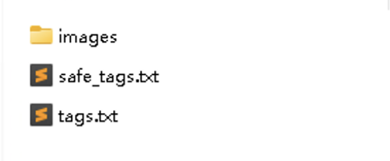
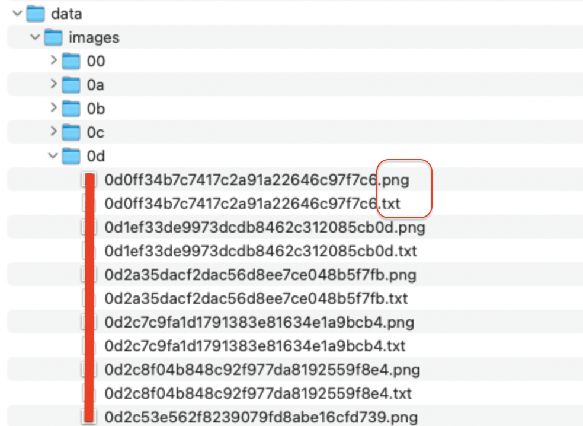
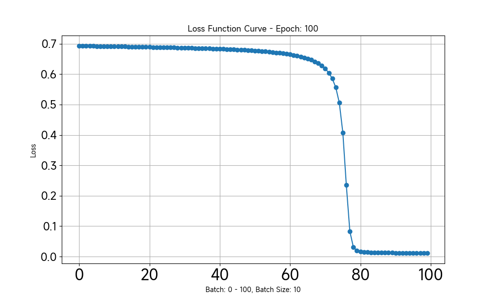
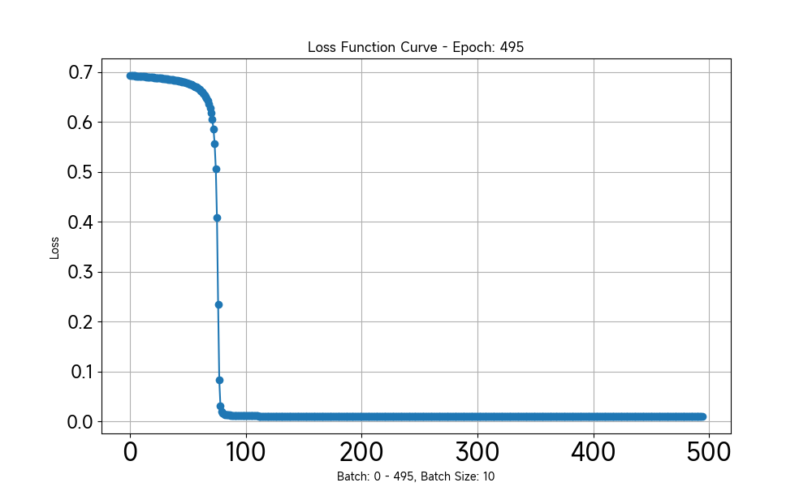

# pytorch 版本 DeepDanbooru 的自定义图片、标签集训练（train）

  * `DeepDanbooru` 原作者是使用的 Tensorflow 进行训练的， `danbooru-train-pytorch`这里将其改为 `Pytorch` 实现训练

  * 标签集改为 一张图片 对应 一个 .txt 文件， 不再采用原来的 sqlite3 模式

  * 每完成一次 epoch， 会生成一张 loss（损失函数）值的图片，以1000张图片为例，训练到 100 个 epoch 时，loss下降就比较理想了。

  * 数据集和标签集采用相同索引， 方便用数组截取的方式设置图片数量，比如只想训练 100 张，就同时取图片集的 [0:100] 和标签集的 [0:100]， 即可，对于低算力显卡做验证更方便，全部调试好了，可以放到云端高算力显卡训练数万张图片。

## Image

  * 训练集的图片宽高必须为 `512 x 512`，`.png` 格式, 位于 `data/images`

  * 图片文件名为 `md5 值 + .png`, 文件夹名称为 `md5值的前两位`, 标签集为同路径下同 md5 值，但是后缀名为 .txt 的文本文件

  * `data` 文件下有：
    `tags.txt`原始的标签集(共9176个标签)
    `safe_tags.txt`（共6684个标签，为从`tags.txt`中移除了一些 nsfw 的标签）
    `image_classes.txt`（图片集中已有的标签，少于或等于`safe_tags.txt`的数量）

## Loss 图例

## 图片推理

  * 生成的模型位于 `output/DeepDanbooru/model_{epoch}.pth`

